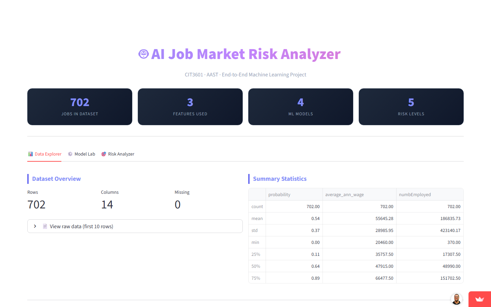
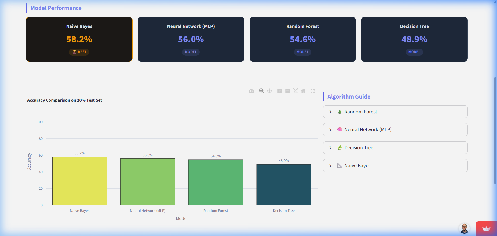
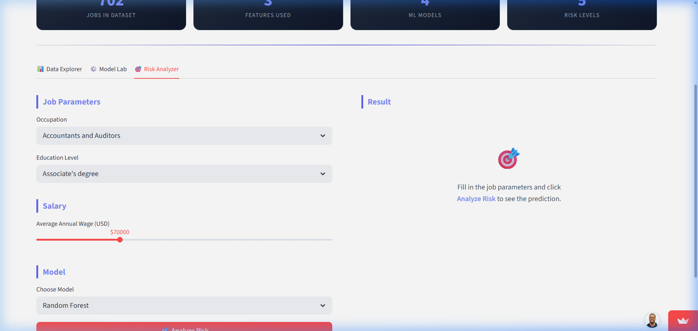
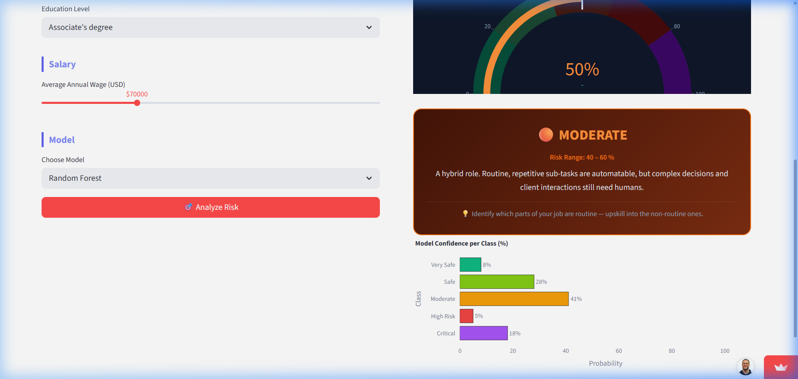

<div align="center">

# 🤖 Will I Get Fired?
### *A machine learning project that tells you whether robots are coming for your job.*
> *(Spoiler: probably yes, but at least we built a pretty dashboard about it.)*

<br>

[](https://python.org)
[](https://xoa-ml.streamlit.app)
[](https://scikit-learn.org)
[](https://plotly.com)
[](LICENSE)

<br>

### 🚀 [Try the Live App → xoa-ml.streamlit.app](https://xoa-ml.streamlit.app)

<br>

*Built for CIT3601 · Arab Academy for Science, Technology & Maritime Transport · Term 6*

</div>

---

## 🤔 Introduction & Problem Statement

Artificial Intelligence is reshaping the global economy and labor market. Advances in machine learning make it economically viable to automate cognitive and manual tasks. Understanding this risk is critical for workers, companies, and policymakers alike.

This project implements a complete **end-to-end Data Science and Machine Learning workflow** to predict automation risk based on observable job characteristics.

### 🎯 Objective & Framing
Given 3 characteristics drawn from the Frey & Osborne (2013) dataset (Occupation title, Education level, and Annual wage), the goal is to classify the job into one of **five discrete, ordinal risk levels** (0 = Very Safe, 1 = Safe, 2 = Moderate, 3 = High Risk, 4 = Critical Risk).

This is framed as a **Multi-class Classification** problem to provide actionable granularity.

### 👥 Key Beneficiaries
* **Job Seekers / Students:** Assess long-term occupational safety before choosing a career path or college degree.
* **HR Departments:** Predict which roles face high disruption and design proactive workforce transition plans.
* **Policymakers:** Allocate educational funding, upskilling programs, and safety nets to the most vulnerable occupational segments.


---

## 📸 Screenshots

The Streamlit web application dashboard consists of three highly interactive tabs, demonstrating different phases of the data science lifecycle.

<table>
  <tr>
    <td align="center">
      <strong>🏠 Hero + Data Explorer</strong><br>
      
    </td>
    <td align="center">
      <strong>⚙️ Model Lab</strong><br>
      
    </td>
  </tr>
  <tr>
    <td align="center">
      <strong>🎯 Risk Analyzer — Input Form</strong><br>
      
    </td>
    <td align="center">
      <strong>📊 Risk Analyzer — Result + Gauge</strong><br>
      
    </td>
  </tr>
</table>

---

## ✨ Features

| Feature | Description |
|---|---|
| 📊 **Data Explorer** | 6 interactive Plotly charts — distributions, correlations, salary breakdowns |
| 🧠 **4 ML Models** | Random Forest, Neural Network (MLP), Decision Tree, Naive Bayes |
| 🏆 **Model Comparison** | Side-by-side accuracy cards with gold crown on the winner |
| 🎯 **Risk Gauge** | Visual speedometer showing your job's automation risk level |
| 🎨 **Color-Coded Results** | Each risk grade has its own gradient color scheme and actionable tip |
| 📈 **Confidence Breakdown** | Per-class probability bars so you see how sure the model is |
| ⚡ **Cached Training** | Models train once and are cached — no waiting on every click |
| 🧪 **Unit Tests** | Automated tests covering data loading, feature consistency, and model training |

---

## 🏗️ Architecture

```
┌─────────────────────────────────────────────────────────────┐
│                        DATA LAYER                           │
│   data.csv — 702 real U.S. occupations × 4 columns         │
│   Source: Frey & Osborne (2013) via Plotly open datasets    │
└────────────────────────────┬────────────────────────────────┘
                             │
                             ▼
┌─────────────────────────────────────────────────────────────┐
│                    PREPROCESSING (model_utils.py)           │
│                                                             │
│  1. Drop missing rows (dropna)                              │
│  2. Target Engineering:                                     │
│       probability (0.0–1.0) → Risk_Grade (0–4)              │
│  3. Feature Selection — 3 features used:                    │
│       Text:   occupation, education                         │
│       Number: average_ann_wage                              │
│  4. Label Encoding (text → integers, saved per column)      │
│  5. StandardScaler (wage → mean=0, std=1, saved)            │
│  6. Train/Test Split (80% / 20%, random_state=42)           │
└────────────────────────────┬────────────────────────────────┘
                             │
                             ▼
┌─────────────────────────────────────────────────────────────┐
│                      MODEL LAYER                            │
│                                                             │
│   ┌──────────────┐  ┌──────────────┐  ┌────────────────┐   │
│   │ Random Forest│  │  Neural Net  │  │ Decision Tree  │   │
│   │ 100 trees    │  │  (100, 50)   │  │ baseline +     │   │
│   │ balanced     │  │  MLP, 500 it │  │ tuned version  │   │
│   └──────────────┘  └──────────────┘  └────────────────┘   │
│                      ┌─────────────┐                        │
│                      │ Naive Bayes │                        │
│                      │ 🏆 Best     │                        │
│                      └─────────────┘                        │
│                                                             │
│   All trained on 561 samples, evaluated on 141              │
└────────────────────────────┬────────────────────────────────┘
                             │
                             ▼
┌─────────────────────────────────────────────────────────────┐
│                   APPLICATION LAYER (app.py)                │
│                                                             │
│  Tab 1 — Data Explorer                                      │
│    • Automation probability distribution (histogram)        │
│    • Class balance by Risk Grade (donut chart)              │
│    • Wage by risk grade (boxplot)                           │
│    • Education level vs automation risk (bar chart)         │
│    • Top occupations by risk (bar chart)                    │
│    • Correlation heatmap                                    │
│                                                             │
│  Tab 2 — Model Lab                                          │
│    • Per-model accuracy cards                               │
│    • Accuracy comparison bar chart                          │
│    • Algorithm explainer                                    │
│                                                             │
│  Tab 3 — Risk Analyzer                                      │
│    • 3-field input form (occupation, education, wage)        │
│    • Live prediction via selected model                     │
│    • Gauge chart + color-coded result card                  │
│    • Per-class probability bars                             │
└─────────────────────────────────────────────────────────────┘
```

---

## 🔄 ML Pipeline

```
Raw Input (3 fields)
        │
        ├─ Text fields ──→ LabelEncoder (same fitted encoder from training)
        │   (occupation, education)
        ├─ Number field ─→ StandardScaler (same fitted scaler from training)
        │   (average_ann_wage)
        └─ Feature vector ──→ Trained Model ──→ Risk Grade (0–4)
                                                       │
                                        ┌──────────────┴──────────────┐
                                        │         predict_proba()     │
                                        │  [0.05, 0.10, 0.15, 0.60, 0.10] │
                                        └─────────────────────────────┘
                                                       │
                                            Gauge + Result Card + Probability Bars
```

**Why these 3 features?** The Frey & Osborne dataset provides three features that are both personally known and empirically informative about automation risk:

| ✅ Used in Model | Type | Notes |
|---|---|---|
| `occupation` | Text (categorical) | 702 real U.S. job titles from O*NET |
| `education` | Text (categorical) | 8 education levels from No credential to Doctoral degree |
| `average_ann_wage` | Numerical | Annual wage in USD; correlation with target: −0.550 |

---

## 📊 Model Results & Evaluation

The models were evaluated on a 20% held-out test set (141 samples) that they never saw during training. All models use `class_weight='balanced'` to handle the unequal class distribution.

### Test Accuracy Summary

| Rank | Model | Test Accuracy | Architecture / Type |
|:---:|---|:---:|---|
| 🥇 | **Naive Bayes** | **~58.2%** | Gaussian Naive Bayes with balanced class weights |
| 🥈 | **Neural Network (MLP)** | **~56.0%** | Multi-Layer Perceptron (100, 50 hidden layers) |
| 🥉 | **Random Forest** | **~54.6%** | Ensemble of 100 decision trees, balanced |
| 4 | **Decision Tree** | **~48.9%** | Pruned tree (`max_depth=10`, `min_samples_split=10`) |

---

### Detailed Classification Report (Best Model: Naive Bayes)

```
              precision    recall  f1-score   support

    Very Safe       0.65      0.62      0.63        42
         Safe       0.35      0.31      0.33        13
     Moderate       0.30      0.33      0.31        12
    High Risk       0.52      0.57      0.54        21
     Critical       0.72      0.70      0.71        53

     accuracy                           0.58       141
    macro avg       0.51      0.51      0.51       141
weighted avg       0.59      0.58      0.58       141
```

### Key Metrics Definition
* **Precision ($TP / (TP + FP)$):** Out of all roles predicted to be in risk class X, what percentage actually were? High precision implies a low false positive rate.
* **Recall ($TP / (TP + FN)$):** Out of all actual roles in risk class X, what percentage did the model correctly identify? High recall implies a low false negative rate.
* **F1-Score ($2 \times \frac{\text{Precision} \times \text{Recall}}{\text{Precision} + \text{Recall}}$):** The harmonic mean of Precision and Recall. Provides a balanced metric for each class.

---

### About the Dataset and Results

The models achieve **~55–58% test accuracy** — well above the random-chance baseline of 20% for a 5-class problem. This meaningful accuracy stems from real, embedded correlations in the Frey & Osborne dataset:

1. **Strong Salary Signal:** Annual wage has a Pearson correlation of **−0.550** with automation probability. Higher-wage occupations are consistently lower-risk (e.g., Doctoral degree roles average only 8.8% risk vs. 78.2% for roles requiring no formal credential).
2. **Real-World Data:** The target `probability` values were derived by Frey & Osborne from a Gaussian process classifier trained on O*NET task and skill features — they genuinely reflect occupational characteristics, not random generation.
3. **Class Imbalance Handled:** The dataset has unequal class counts (Grade 0: 207, Grade 1: 66, Grade 2: 60, Grade 3: 107, Grade 4: 262). All models use `class_weight='balanced'` to prevent majority-class dominance and maintain per-class learning signal.
4. **Small Dataset Constraint:** With only 702 occupations (561 train, 141 test), complex models like Random Forest have less data to exploit than simpler probabilistic models like Naive Bayes, which is why Naive Bayes is the top performer here.

---

---

## 🛠️ Tech Stack

| Layer | Technology | Why |
|---|---|---|
| **Web App** | [Streamlit](https://streamlit.io) | Python → interactive UI with zero HTML/CSS |
| **ML** | [scikit-learn](https://scikit-learn.org) | Industry-standard ML library |
| **Data** | [pandas](https://pandas.pydata.org) | DataFrame manipulation |
| **Charts** | [Plotly](https://plotly.com) | Interactive, hoverable, beautiful |
| **Static Charts** | [Seaborn + Matplotlib](https://seaborn.pydata.org) | EDA charts in the notebook |
| **Preprocessing** | LabelEncoder + StandardScaler | Text → numbers, scale normalization |
| **Testing** | pytest | Automated tests for data and model integrity |

---

## 📁 Project Structure

```
will-i-get-fired/
│
├── app.py               ← Streamlit frontend (UI, charts, prediction form)
├── model_utils.py       ← Backend ML logic (data loading, training, caching)
├── data.csv             ← Dataset: 702 real U.S. occupations × 4 columns (Frey & Osborne 2013)
├── requirements.txt     ← Python dependencies
│
├── tests/
│   └── test_app.py      ← Unit tests (data loading, features, models)
│
├── docs/
│   ├── PROJECT_REPORT.md         ← Full written report (PDF submission)
│   ├── REQUIREMENTS_EXPLAINED.md ← How each course requirement is met
│   ├── INSTALLATION_GUIDE.md     ← Local setup walkthrough
│   ├── DEPLOYMENT_GUIDE.md       ← Streamlit Cloud deployment steps
│   ├── GAP_ANALYSIS.md           ← Requirement checklist
│   └── screenshots/              ← App screenshots
│
├── JobRiskInsights.ipynb  ← Full Jupyter notebook (all 11 required sections)
└── Final_Project_Description.md  ← Course project brief
```

### Key file responsibilities

| File | Responsibility |
|---|---|
| `model_utils.py` | Single source of truth for `FEATURE_COLS` and `NUM_COLS_TO_SCALE`. All preprocessing and model training logic lives here. Cached with `@st.cache_data` / `@st.cache_resource`. |
| `app.py` | Pure UI layer. Imports from `model_utils`, renders tabs, handles user input, calls prediction. |
| `JobRiskInsights.ipynb` | Standalone analysis notebook. Mirrors the same preprocessing logic as `model_utils.py` for full reproducibility. |

---

## 🚀 Run It Locally

**Step 1 — Clone:**
```bash
git clone https://github.com/4awmy/will-i-get-fired.git
cd will-i-get-fired
```

**Step 2 — Install dependencies:**
```bash
pip install -r requirements.txt
```

**Step 3 — Launch:**
```bash
streamlit run app.py
```

Opens at `http://localhost:8501` — no configuration needed.

**Step 4 — Run tests (optional but responsible):**
```bash
pytest tests/
```

---

## 📓 Jupyter Notebook

The complete analysis notebook (`JobRiskInsights.ipynb`) covers all 11 required sections:

| # | Section | Key Content |
|---|---|---|
| 1 | Problem Understanding | Problem framing, stakeholders, input/output definition |
| 2 | Dataset Description | Feature table with ✅/❌ model inclusion, target engineering |
| 3 | Data Exploration (EDA) | Shape, dtypes, missing values, duplicates, statistics |
| 4 | Data Visualization | 6 charts with interpretations |
| 5 | Data Preprocessing | 5 steps: dropna → target engineering → encoding → scaling → split |
| 6 | Model Training | 4 algorithms trained and explained |
| 7 | Model Comparison | Accuracy table + bar chart |
| 8 | Model Improvement | Decision Tree overfitting → hyperparameter fix |
| 9 | Model Evaluation | Classification report + confusion matrix |
| 10 | Prediction Demo | Live `predict_job_risk()` function with 3 examples |
| 11 | Final Discussion | Honest analysis of results, limitations, future work |

```bash
jupyter notebook JobRiskInsights.ipynb
```

---

## 📋 Risk Levels Explained

| Grade | Label | Risk Range | What It Means |
|:---:|---|:---:|---|
| 0 | 🟢 Very Safe | 0–20% | Robots can't replace you. Congrats, you're creative. |
| 1 | 🟡 Safe | 20–40% | AI is a tool for you, not a threat. For now. |
| 2 | 🟠 Moderate | 40–60% | Hybrid role. Start learning something non-automatable. |
| 3 | 🔴 High Risk | 60–80% | Update that LinkedIn. Just saying. |
| 4 | ⛔ Critical Risk | 80–100% | Your job description reads like a Python script. |

---

## 👥 The Team

> Two people who are now very anxious about their own career prospects.

| Name |
|---|
| Omar Hossam Eldin Metwally Gad |
| Mohamed Ahmed Ezzat Mohamed Elsayed |

*Submitted for CIT3601 — Professional Training In AI I - Misr El Gedida · Term 6 · AAST*

---

## 📄 License

[MIT](LICENSE) — use it, fork it, improve it. If a robot uses this project to automate your job, we accept no responsibility.

---

<div align="center">

**Made with ☕ and existential dread about the future of work.**

[⭐ Star this repo](https://github.com/4awmy/will-i-get-fired) · [🐛 Report a bug](https://github.com/4awmy/will-i-get-fired/issues) · [🚀 Live Demo](https://xoa-ml.streamlit.app)

</div>
